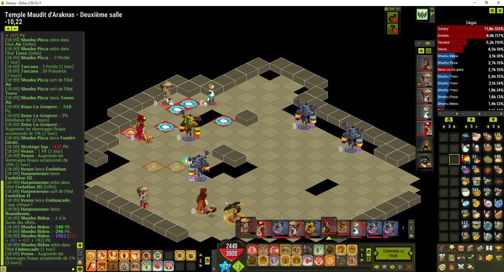

## Dofus Meter
Dofus Meter est une application non officiel pour le jeu Dofus. Cette dernière est gratuite et réalisé sur le temps libre.

Son but est de donner un outil simple de mesure des dégats et soin en jeu grâce à des graphiques. Il est le successeur plus léger et simplifié de [Dofixed](https://dofixed.github.io/).

Divers réglages sont disponibles afin de personnaliser l'affichage et le calcule des graphiques.

## Utilisation
### Installation

Vous pouvez télécharger le .zip contenant l’application en suivant [ce lien](https://github.com/DofusMeter/archive/raw/master/DofusMeter.zip).

Extraire le contenu du .zip dans un dossier dédié à Dofus Meter (où vous voulez tant que le dossier est vide).

### Lancement

S'assurer que votre client Dofus est bien parametré pour utiliser le port `5555` (c'est le port par défaut, si vous n'avez rien changer ça devrait déjà être le cas).

Lancer directement `DofusMeter.exe`.

La fenêtre principale apparaîtra, ainsi qu'une icone dans la zone de notification.

NB : Vous pouvez créer un raccourci depuis `DofusMeter.exe` en cliquant droit dessus, puis `Envoyer vers > Bureau (Créer un raccourci)`.

### Mise à jour

Dofus Meter se mettra à jour tout seul à chaque lancement.

### Désinstallation

Supprimez le dossier dans le quel vous avez extrait l'archive, puis supprimer le dossier `%AppData%\Dofixed\DofusMeter`.

## Limitations

*  Windows 10
*  Mono compte

## Avertissement

Attention, Dofus Meter n’a pas été autorisé par la société Ankama. Les CGU du jeu précisent qu’il est interdit d’utiliser des outils tiers ou d’en faire la pub sur le jeu/forum officiel. Dofus Meter ne respecte donc pas les CGU et un risque de ban est toujours présent. L’équipe Dofus Meter ne peut être tenue responsable en cas de ban. Cependant, Dofus Meter ne modifie pas le jeu ou ses fichiers, il ne fait que l’observer et afficher des informations. Il ne s’agit en aucun cas d’un bot et aucune action n’est automatisée. Par conséquent, l’utilisation de Dofus Meter n’est pas plus détectable par le jeu que celle de Paint ou de Discord, et nous serions très surpris de voir un ban arriver.
